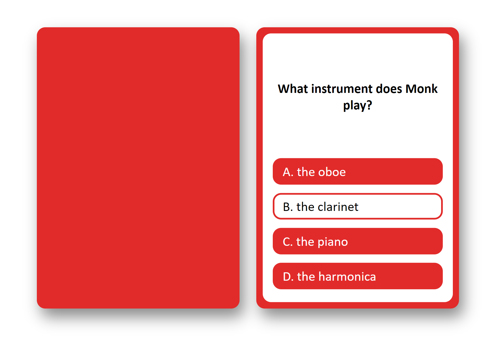

# Trivia Card Generator

Check it out: [Generator](https://grem1ly.github.io/trivia_card_generator/)

**Note:** Edits are still underway.

## Objective

Trivia is undoubtedly a classic game. It's fun, it's simple, and it really reveals just how many random facts you know. That being said, many trivia related games are genre specific and it can be difficult to find those that either you enjoy or excel at. I for one have always enjoyed the T.V. show Monk and have been dying to play some sort of Monk trivia. Given the lack of an official version, I decided to create my own, and one such step involved creating the actual cards. Although there are a lot of platforms out there that enable the creation and even the production of trivia cards, they didn't appeal to me as I found them difficult to work with. Therefore, I created not only a trivia card template that I actually liked, but a generator as well to prevent a limit for the number of possible questions I could include. These cards are adaptable to any genre, so should you ever need to create your own trivia cards, feel free to use this tool!

<b>Example:</b>

## How To Use It&thinsp;[1](#foot1)

  * **Step 1:** Once the website is loaded, click on the "Start" button to begin.

  * **Step 2:** You will be prompted with the option to format your cards in relation to color, font, and the image displayed on the front side of the card **(color customization is the only feature currently supported)**. To select your desired color, either click on one of the options presented or enter your own color. You can always reset the color too. Once you are satisfied with your selection, click the "Continue" button.

  * **Step 3:** You will be prompted with a choice to either: (1) upload your own trivia card content following a tsv&thinsp;[2](#foot2) format that specifies the question, option 1, option 2, option 3, and the answer, or (2) manually enter the content for each card. If you choose to generate your cards based on content upload, you will have the option to manually create additional cards after generation.

  * **Step 4:** Manually fill out or modify your trivia cards.[3](#foot3) To fill out each card, click on the empty white area to insert your question, and click on the subsequent rectangles to insert the different options. The white rectangle is intended to represent the correct answer&thinsp;[4](#foot4).
      * Clicking on these areas will display you with prompts, so just answer the questions accordingly. If you need to make changes after the fact, just re-click each area to be prompted again.
      * The font size can also be altered for each question and each option. To make use of this, just re-click the area intended to be modified, click "OK" when asked "Keep as is?", click "Cancel" when asked "Keep same size?", and then insert your desired text size (e.g. 12).

  * **Step 5:** Click the "Add Card" button to add a new card.

  * **Step 4:** Repeat Steps 4 - 5 for however many cards you wish to create.

   

  <b id="foot1">1</b> The steps are also made available when hovering over the information icon on the homepage. [←](#ref1) 
  <b id="foot2">2</b> The tsv file to be uploaded is assumed to "live" in the `./data` folder; this is a workaround for accessing local files. [←](#ref2) 
  <b id="foot3">3</b> Since the face of each card cannot be customized, only the backs are presented. [←](#ref3) 
  <b id="foot4">4</b> For each card added, the correct answer rectangle will change positions for diversity. [←](#ref4)
